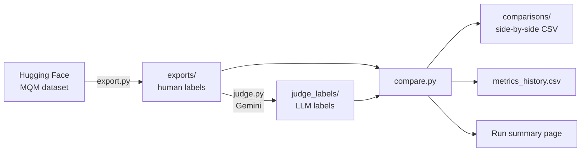
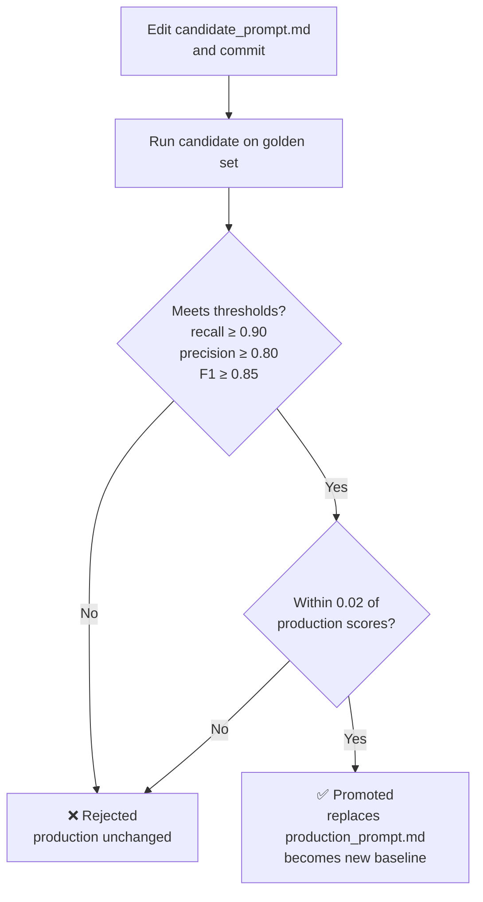

[README.md](https://github.com/user-attachments/files/32983900/README.md)
# LLM Translation Evaluation Pipelines

Automated evaluation workflows for LLM-based translation quality assessment, built with Python and GitHub Actions. The repository contains two independent projects:

1. **Daily-exports**: a daily pipeline that pulls professionally annotated translation data, labels it with an LLM judge, and measures how closely the judge agrees with human annotators.
2. **Business-risk judge**: a prompt for detecting critical business risks in translations, with an automated regression test that promotes a new prompt version only when it meets quality thresholds and doesn't perform worse than the current production version.

Together they demonstrate an end-to-end approach to LLM-as-judge evaluation: blind judging against human ground truth, calibration metrics tracked over time, golden-dataset regression testing, and threshold-gated prompt promotion.

> These projects are portfolio demonstrations of workflows I run professionally. All data is public, and the brand names, style guide, and risk definitions are fictional samples.

---

## Repository structure

```
evaluation-test/
├── .github/workflows/
│   ├── daily-export.yml          # daily export + LLM judge labeling
│   ├── compare.yml               # judge vs. human metrics (runs after the export)
│   └── prompt-regression.yml     # Business risk: test and auto-promote prompt changes
├── requirements.txt
├── daily-exports/
│   ├── export.py                 # Pulls human-annotated translations
│   ├── judge.py                  # Labels translations with the LLM judge
│   ├── compare.py                # Compares labels and calculates metrics
│   ├── exports/                  # Daily human-annotated data
│   ├── judge_labels/             # Daily LLM judge labels
│   └── comparisons/              # Side-by-side comparisons + metrics_history.csv
└── business-risk/
    ├── eval_prompt.py            # Regression test and promotion logic
    ├── eval_config.json          # Model, file paths, and promotion thresholds
    ├── prompts/
    │   ├── candidate_prompt.md   # The prompt under development (edit this one)
    │   ├── production_prompt.md  # The current approved prompt (changed only by promotion)
    │   ├── production_metrics.json
    │   ├── promotion_log.csv
    │   └── style_guide_de.md     # Locale style guide injected into the prompt
    ├── golden/
    │   └── business_risk_golden.csv
    └── eval_results/             # Per-run results + eval_history.csv
```

---

## Project 1: Daily Exports

### What it does



Every day at 09:00 UTC:

1. **Export** (`export.py`) downloads a new batch of 50 English→German translations from the WMT MQM error-span dataset. Each translation comes with errors marked by professional annotators, including the error text and its severity (minor or major).
2. **Judge** (`judge.py`) sends the same translations to an LLM (Gemini) with an MQM-style prompt and saves its labels. The judge never sees the human annotations.
3. **Compare** (`compare.py`) runs automatically once the export succeeds. It matches the judge's labels to the human labels and calculates:
   - **Accuracy**: how often the judge's overall severity matches the human label exactly
   - **Precision, recall, and F1 for each label** (no error, minor, major)
   - **Macro-F1**: the average F1 across all three labels
   - **A confusion matrix** showing where the judge and humans disagree

Results are committed back to the repository, so every day's data, labels, and metrics stay versioned. The metrics also appear on each workflow run's summary page, and `metrics_history.csv` tracks the trend over time.

### Design decisions

- **The judge is blind to the ground truth.** Judging and scoring are separate scripts, so the judge can't be influenced by the human labels, and the scoring logic can be changed and re-run on past data without calling the LLM again.
- **Matching label scales.** The human annotators for this data used only minor and major severities, so the judge is restricted to the same scale to keep the labels comparable.
- **Translation-level comparison.** Each translation's overall label is its most severe error. This keeps the comparison simple and reliable, at the cost of not checking whether the judge flagged the exact same text spans.
- **Batched judging.** The judge evaluates 10 translations per request to stay within free-tier rate limits. Batching can slightly change model behavior compared with judging items one at a time, so the prompt instructs the model to judge each item independently, and the group size is configurable (`GROUP_SIZE` in `judge.py`) for comparison.
- **Clear failure modes.** If the API hits a rate limit, the judge waits once and then stops with the provider's error message, instead of retrying silently or producing partial results.

### Re-running a comparison for a past date

In the **Actions** tab, open **Compare judge vs human → Run workflow** and enter a date (`YYYY-MM-DD`). Re-running a date replaces that date's row in the metrics history rather than duplicating it.

---

## Project 2: Business-risk judge with regression testing

### The judge

The prompt in `business-risk/prompts/` flags translations that contain a **critical business risk**: an error that could harm users, create legal or financial exposure, or seriously damage the brand if published. It defines five categories:

| Category | Examples |
|---|---|
| `safety` | Reversed negations in warnings, wrong dosages or limits, reversed allergen information |
| `legal_privacy` | Changed refund or warranty terms, reversed privacy commitments, policies omitted from consent text |
| `financial_numeric` | Wrong prices, amounts, or deadlines; dropped offer conditions; misconverted US dates |
| `offensive` | Profanity, slurs, or insulting language not present in the source |
| `brand` | Protected brand or product names translated or altered |

Just as important, the prompt defines what **not** to flag: grammar and spelling errors, style-guide violations, terminology preferences, and awkward wording, as long as the meaning is intact. Separating quality issues from business risks is the core difficulty of this task, and the golden dataset is designed to test it.

The locale style guide (`style_guide_de.md`) is kept in its own file and injected into the prompt at run time, so linguistic resources can be updated without editing the prompt itself.

### The golden dataset

`golden/business_risk_golden.csv` contains 26 labeled English→German translations: 13 with critical business risks and 13 without. The non-critical items are deliberately challenging, such as an informal "du" form, a missing thousands separator, or a correctly converted date that sits right next to a misconverted one in the critical set.

### Regression testing and promotion



Any commit that changes the candidate prompt, the style guide, the golden set, or the thresholds triggers the **Prompt regression test** workflow. It:

1. Runs the candidate prompt against every golden item.
2. Calculates precision, recall, F1, and accuracy for detecting critical risks, plus category accuracy for correctly flagged items.
3. Checks the scores against the thresholds in `eval_config.json` and against the current production prompt's scores.
4. **Promotes** the candidate automatically if every check passes, or **rejects** it and leaves production untouched if any check fails.

The run's summary page shows the candidate's scores next to production's, the result of each check, and a table of every item the judge got wrong, with the judge's reasoning. Every attempt is recorded in `eval_results/eval_history.csv`, and every promotion in `prompts/promotion_log.csv`.

### Design decisions

- **Recall has the highest threshold.** Missing a real business risk is usually more costly than a false alarm a reviewer can dismiss, so the bar for catching risks is set higher than the bar for precision.
- **Regression is checked separately from thresholds.** A candidate that clears the absolute thresholds but performs worse than the current production prompt is still rejected.
- **Prompt examples are kept out of the golden set.** The few-shot examples inside the prompt don't appear in the golden data, so the test measures whether the prompt generalizes rather than whether the model can repeat its examples.
- **Thresholds live in configuration.** They can be tuned in `eval_config.json` without code changes, and changing them triggers a fresh test.
- **Incomplete runs can't be promoted.** If the judge fails to answer any golden item, the candidate is rejected.

---

## Setup

1. **Add the repository secrets** under **Settings → Secrets and variables → Actions**:
   - `HF_TOKEN`: a Hugging Face access token (read access)
   - `GEMINI_API_KEY`: a Google AI Studio API key
2. **Allow workflows to commit** under **Settings → Actions → General → Workflow permissions** by selecting **Read and write permissions**.
3. **Run the workflows** from the **Actions** tab, or let them run on their own: the daily-exports runs daily, and the regression test runs whenever the business-risk files change.

### Tech stack

Python 3.12 · GitHub Actions · Hugging Face Hub · Google Gemini API

---

## Limitations and next steps

- **Small golden set.** With 13 critical examples, a single miss lowers recall by about 0.08. A larger and more varied golden set would give steadier scores.
- **LLM non-determinism.** Even at temperature 0, results can vary slightly between runs, so a borderline candidate may pass one run and fail the next. Averaging several runs per evaluation would make promotion decisions more robust.
- **Span-level agreement.** The MQM comparison works at the translation level. Measuring overlap between the exact error spans flagged by the judge and by humans would give a finer-grained view.
- **Connecting the projects.** A natural next step is to have the daily pipeline load the promoted `production_prompt.md`, so an approved prompt goes into use automatically the next day.
- **Free-tier constraints.** Batch sizes and pacing are tuned for Gemini's free tier. A paid tier would allow larger daily batches and one-item-per-request judging.

---

## Data and attribution

The daily-exports uses English→German translations with expert MQM error annotations from the WMT shared tasks, accessed through the [`RicardoRei/wmt-mqm-error-spans`](https://huggingface.co/datasets/RicardoRei/wmt-mqm-error-spans) dataset on Hugging Face. See the dataset card for its sources and license terms.

The business-risk golden set, style guide, and brand names (NovaPay, QuickSend) are synthetic examples created for this project.

---

**Author:** [Laura Gomez Chacon] · [LinkedIn](https://www.linkedin.com/in/laura-gomez-chacon-40b47022)
