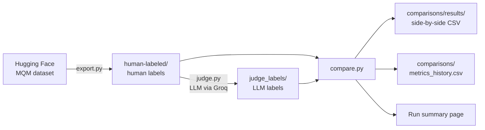
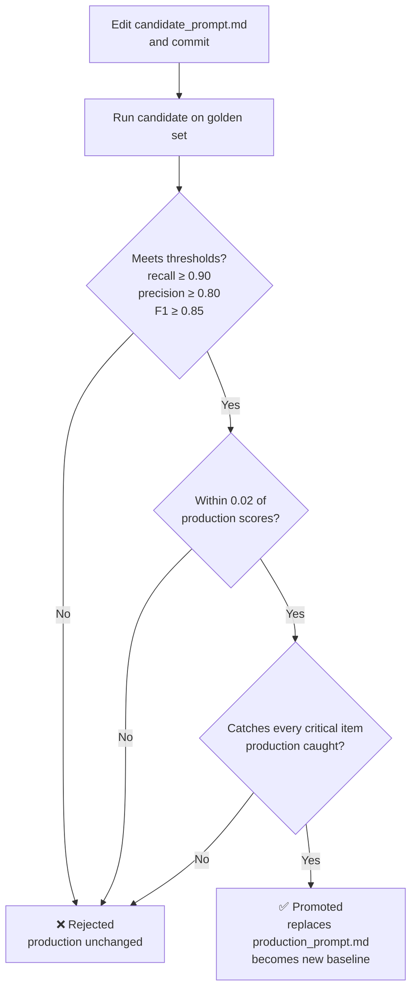

# LLM Translation Evaluation Pipeline

Automated evaluation workflows for LLM-based translation quality assessment, built with Python and GitHub Actions. The repository contains two independent projects:

1. **Daily exports**: a daily pipeline that pulls professionally annotated translation data, labels it with an LLM judge, and measures how closely the judge agrees with human annotators.
2. **Prompt management**: a prompt for detecting critical business risks in translations, with an automated regression test that promotes a new prompt version only when it meets quality thresholds and doesn't perform worse than the current production version.

Together they demonstrate an end-to-end approach to LLM-as-judge evaluation: blind judging against human ground truth, calibration metrics tracked over time, golden-dataset regression testing, and threshold-gated prompt promotion.

**[View the live results dashboard](https://gomezclint.github.io/evaluation-test/dashboard/)**

> These projects are portfolio demonstrations of workflows I run professionally. All data is public, and the brand names, style guide, and risk definitions are fictional samples.

---

## Repository structure

```
evaluation-test/
├── .github/workflows/
│   ├── daily-export.yml            # Daily export + LLM judge labeling
│   ├── compare.yml                 # Judge vs. human metrics, alerts, and SQL report (runs after the export)
│   ├── freshness-check.yml         # Morning check that today's results exist
│   └── prompt-regression.yml       # Prompt management: test and auto-promote prompt changes
├── .gitignore                      # Keeps Python cache files out of the repo
├── .nojekyll                       # Tells GitHub Pages to serve files as-is
├── requirements.txt
├── dashboard/
│   └── index.html                  # Results dashboard (GitHub Pages)
├── analysis/
│   ├── db.py                       # Loads the result files into SQL tables
│   ├── run_queries.py              # Runs every query and writes the report
│   ├── check_alerts.py             # Checks alert rules and opens or closes GitHub issues
│   ├── alerts_config.json          # Alert thresholds
│   ├── queries/                    # One SQL file per analysis question
│   │   ├── 01_judge_bias.sql
│   │   ├── 02_weekly_trend.sql
│   │   ├── 03_rolling_baseline.sql
│   │   └── 04_hardest_golden_items.sql
│   └── reports/
│       ├── latest.md               # Latest SQL report
│       ├── latest.json             # Latest SQL results, read by the dashboard
│       └── alerts.json             # Current status of each alert rule, read by the dashboard
├── daily-exports/
│   ├── export.py                   # Pulls human-annotated translations
│   ├── judge.py                    # Labels translations with the LLM judge
│   ├── compare.py                  # Compares labels and calculates metrics
│   ├── human-labeled/              # Daily human-annotated data
│   ├── judge_labels/               # Daily LLM judge labels
│   └── comparisons/
│       ├── metrics_history.csv     # One row per day (daily runs only)
│       ├── results/                # Daily side-by-side comparisons
│       └── manual-runs/            # Manually triggered comparisons, kept separately
└── prompt-management/
    ├── regression_test.py          # Regression test and promotion logic
    ├── regression_config.json      # Model, file paths, and promotion thresholds
    ├── prompts/
    │   ├── candidate_prompt.md     # The prompt under development (edit this one)
    │   ├── production_prompt.md    # The current approved prompt (changed only by promotion)
    │   ├── production_metrics.json # Baseline scores of the production prompt
    │   ├── production_items.json   # Baseline item-by-item results of the production prompt
    │   ├── promotion_log.csv       # One row per promotion
    │   └── style_guide_de.md       # Locale style guide injected into the prompt
    ├── golden/
    │   └── business_risk_golden.csv
    └── regression_results/         # Per-run results + regression_history.csv

```

---

## Project 1: Daily exports

### What it does



Every day at 04:00 UTC:

1. **Export** (`export.py`) downloads a new batch of 20 English→German translations from the WMT MQM error-span dataset. Each translation comes with errors marked by professional annotators, including the error text and its severity (minor or major).
2. **Judge** (`judge.py`) sends the same translations to an LLM (`openai/gpt-oss-120b` via the Groq API) with an MQM-style prompt and saves its labels. The judge never sees the human annotations.
3. **Compare** (`compare.py`) runs automatically once the export succeeds. It matches the judge's labels to the human labels and calculates:
   - **Accuracy**: how often the judge's overall severity matches the human label exactly
   - **Precision, recall, and F1 for each label** (no error, minor, major), shown alongside how many translations the humans and the judge each assigned to that label
   - **Macro-F1**: the average F1 across all three labels
   - **Cohen's kappa** and **weighted kappa**: agreement between judge and humans, corrected for agreement expected by chance. The weighted version uses quadratic weights, so confusing "no error" with "major" counts more than confusing neighboring labels.
   - **95% confidence intervals** for accuracy and per-label precision and recall (Wilson intervals), and for macro-F1 and both kappas (bootstrap)
   - **A confusion matrix** showing where the judge and humans disagree

Results are committed back to the repository, so every day's data, labels, and metrics stay versioned. The metrics also appear on each workflow run's summary page, and `comparisons/metrics_history.csv` tracks the trend over time.

### Design decisions

- **The judge is blind to the ground truth.** Judging and scoring are separate scripts, so the judge can't be influenced by the human labels, and the scoring logic can be changed and re-run on past data without calling the LLM again.
- **Matching label scales.** The human annotators for this data used only minor and major severities, so the judge is restricted to the same scale to keep the labels comparable.
- **Kappa alongside accuracy.** Severity labels are often imbalanced, and accuracy can look high simply because the judge favors the most common label. Kappa corrects for chance agreement and is the standard measure of inter-annotator agreement, which makes the judge's results comparable to agreement between human annotators. Weighted kappa reflects that the labels are ordered.
- **Confidence intervals on every headline metric.** With 20 translations a day, the scores carry real uncertainty, and the intervals show which day-to-day changes are meaningful and which are noise.
- **Translation-level comparison.** Each translation's overall label is its most severe error. This keeps the comparison simple and reliable, at the cost of not checking whether the judge flagged the exact same text spans.
- **Batched judging.** The judge evaluates 10 translations per request to stay within free-tier rate limits. Batching can slightly change model behavior compared with judging items one at a time, so the prompt instructs the model to judge each item independently, and the group size is configurable (`GROUP_SIZE` in `judge.py`) for comparison.
- **Clear failure modes.** If the API is rate limited or overloaded, the judge waits 30 seconds, tries once more, and then stops with the provider's error message, instead of retrying silently or producing partial results. A daily-limit error stops it immediately, since retrying can't help.
- **Manual runs never alter the official record.** Daily results and the metrics history are produced only by the scheduled pipeline, so every day is scored the same way and the trend stays comparable. Manual comparisons are treated as investigations and saved separately.

### Running a manual comparison

In the **Actions** tab, open **Compare judge vs human → Run workflow**, optionally enter a date (`YYYY-MM-DD`), and click **Run workflow**. Leaving the date empty uses today.

Manual runs are kept separate from the daily record. Each one is saved to `comparisons/manual-runs/` with the run's date and time in the file name, so repeated runs never overwrite each other. They don't change the daily files in `comparisons/results/` or `metrics_history.csv`, and the run's summary page notes that it was a manual run.

A manual comparison re-scores the judge labels already saved for that date; it doesn't call the judge again. It's useful for checking the effect of changes to the scoring logic in `compare.py`.

---

## Project 2: Prompt management with regression testing and automatic promotion

### The judge

The prompt in `prompt-management/prompts/` flags translations that contain a **critical business risk**: an error that could harm users, create legal or financial exposure, or seriously damage the brand if published. It defines five categories:

| Category | Examples |
|---|---|
| `safety` | Reversed negations in warnings, wrong dosages or limits, reversed allergen information |
| `legal_privacy` | Changed refund or warranty terms, reversed privacy commitments, policies omitted from consent text |
| `financial_numeric` | Wrong prices, amounts, or deadlines; dropped offer conditions; misconverted US dates |
| `offensive` | Profanity, slurs, or insulting language not present in the source |
| `brand` | Protected brand or product names translated or altered |

Just as important, the prompt defines what **not** to flag: grammar and spelling errors, style-guide violations, terminology preferences, and awkward wording, as long as the meaning is intact. Separating quality issues from business risks is the core difficulty of this task, and the golden dataset is designed to test it.

The locale style guide (`style_guide_de.md`) is kept in its own file and injected into the prompt at run time, so linguistic resources can be updated without editing the prompt itself.

### The golden dataset

`golden/business_risk_golden.csv` contains 26 labeled English→German translations: 13 with critical business risks and 13 without. The non-critical items are deliberately challenging, such as an informal "du" form, a missing thousands separator, or a correctly converted date that sits right next to a misconverted one in the critical set.

### Regression testing and promotion



Any commit that changes the candidate prompt, the style guide, the golden set, or the thresholds triggers the **Prompt regression test** workflow. It:

1. Runs the candidate prompt against every golden item.
2. Calculates precision, recall, F1, accuracy, and Cohen's kappa for detecting critical risks, each with a 95% confidence interval, plus category accuracy for correctly flagged items.
3. Checks the scores against the thresholds in `regression_config.json` and against the current production prompt's scores.
4. Compares results item by item with the production prompt, and rejects the candidate if it misses any critical item that production caught.
5. **Promotes** the candidate automatically if every check passes, or **rejects** it and leaves production untouched if any check fails.

The run's summary page shows the candidate's scores next to production's, the result of each check, the critical items the candidate newly missed or newly caught, any new false alarms, and every item the judge got wrong, with its reasoning. Every attempt is recorded in `regression_results/regression_history.csv`, and every promotion in `prompts/promotion_log.csv`.

### Run modes

The workflow runs automatically in **test-and-promote** mode. From the **Actions** tab, **Prompt regression test → Run workflow** offers three modes:

| Mode | What it does |
|---|---|
| `test-and-promote` | Tests the candidate and promotes it if every check passes |
| `test-only` | Tests the candidate and reports the results, but never promotes. Useful for re-running the same candidate to see how much its scores vary. |
| `rebaseline` | Re-scores the current production prompt and saves the results as the new baseline, without promoting anything. Use it after changing the model or the golden set, so candidates are compared with production under the same conditions. |

### Design decisions

- **Recall has the highest threshold.** Missing a real business risk is usually more costly than a false alarm a reviewer can dismiss, so the bar for catching risks is set higher than the bar for precision.
- **Regression is checked separately from thresholds.** A candidate that clears the absolute thresholds but performs worse than the current production prompt is still rejected.
- **Prompt examples are kept out of the golden set.** The few-shot examples inside the prompt don't appear in the golden data, so the test measures whether the prompt generalizes rather than whether the model can repeat its examples.
- **Thresholds live in configuration.** They can be tuned in `regression_config.json` without code changes, and changing them triggers a fresh test.
- **Incomplete runs can't be promoted.** If the judge fails to answer any golden item, the candidate is rejected.
- **Item-level regression gate.** With a small golden set, one item changes recall by about 0.08, so aggregate scores can't distinguish small real differences from noise. The most meaningful regression check is concrete: the candidate must still catch every critical item the production prompt caught. The summary names any newly missed items, which also makes rejections easy to act on. The gate can be switched off with `block_new_misses` in `regression_config.json`.
- **Confidence intervals are reported, not gated.** With 13 critical items, even a perfect recall has a 95% lower bound of about 0.77, so requiring the lower bound to clear a threshold would block every prompt. The intervals are shown so each decision is read with its uncertainty, and could become part of the gate once the golden set is much larger.
- **Baselines are tied to a model.** The baseline records which model produced it, and the summary warns when a candidate is tested on a different model, since score changes could then come from the model rather than the prompt.

---

## Monitoring, alerting, and SQL analysis

The daily pipeline doesn't just report results: it watches them. After each daily comparison, alert rules check the latest results, and SQL queries summarize the full history. Both feed the dashboard.

### Alert rules

`analysis/check_alerts.py` checks four rules. The thresholds live in `analysis/alerts_config.json`.

| Rule | Fires when |
|---|---|
| Weighted kappa below floor | The latest weighted kappa is below 0.40 (moderate agreement) |
| Major errors under-called | The judge calls fewer than 60% of linguist-marked major errors major. Skipped on days with fewer than 3 major errors, since recall on one or two examples is noise. |
| Sudden drop in agreement | The latest weighted kappa is more than 0.15 below the median of the previous 7 days |
| No fresh daily results | There are no results for today. Checked by a separate morning workflow, so it fires even if the pipeline never ran. |

When a rule fires, the workflow opens a GitHub issue labeled `eval-alert`, and GitHub sends a notification. If an issue for that rule is already open, it adds a comment instead of opening a duplicate, and it closes the issue automatically once the rule passes again. While an alert is firing, the dashboard shows a banner on every tab.

### SQL analysis

`analysis/db.py` loads the result files into SQL tables (`daily_history`, `daily_results`, `regression_history`, and `regression_items`). Each file in `analysis/queries/` answers one evaluation question:

| Query | Question |
|---|---|
| `01_judge_bias.sql` | When the judge disagrees with the linguists, does it tend to under-call or over-call severity? |
| `02_weekly_trend.sql` | How do accuracy and agreement move week to week? |
| `03_rolling_baseline.sql` | Is each day's weighted kappa in line with the median of the 7 days before it? |
| `04_hardest_golden_items.sql` | Which golden items do prompt versions get wrong most often? |

`analysis/run_queries.py` runs every query after each daily comparison and writes the results to `analysis/reports/`. The dashboard's **SQL insights** tab shows each query's latest results next to its code. To add an analysis, add a new `.sql` file to `analysis/queries/`.

### Design decisions

- **Compare against a rolling median, not yesterday.** With 20 translations a day, scores move by chance. Comparing with the median of the previous 7 days keeps a single noisy day from triggering an alert, while still catching a real drop.
- **No data is its own alert.** If the daily export fails, the comparison never runs, so quality rules alone would never fire. A separate morning check catches a pipeline that has silently stopped.
- **Avoid alert fatigue.** One issue per rule, updated with comments while it fires, and closed automatically on recovery. Rules that need a minimum number of examples are skipped rather than firing on too little data.
- **One definition of each metric.** The drop alert and the rolling-baseline report run the same SQL file, so the alert, the report, and the dashboard can never disagree.
- **SQL for data, Python for logic.** Queries define and aggregate the metrics, because SQL is declarative, readable by other teams, and runs where production data typically lives. Python handles the API calls, the alert lifecycle, and statistics like confidence intervals. The demo uses SQLite, which is built into Python; in production, the same queries would run against a data warehouse with minor dialect changes.

---

## Setup

1. **Add the repository secrets** under **Settings → Secrets and variables → Actions**:
   - `HF_TOKEN`: a Hugging Face access token (read access)
   - `GROQ_API_KEY`: a Groq API key, from console.groq.com
2. **Allow workflows to commit** under **Settings → Actions → General → Workflow permissions** by selecting **Read and write permissions**.
3. **Run the workflows** from the **Actions** tab, or let them run on their own: the daily-exports pipeline runs daily, and the regression test runs whenever the prompt, style guide, golden set, or configuration changes.

### Tech stack

Python 3.12 · GitHub Actions · Hugging Face Hub · Groq API (`openai/gpt-oss-120b`)

---

## Limitations and next steps

- **Small golden set.** With 13 critical examples, a single miss lowers recall by about 0.08, and the confidence intervals are wide. A larger and more varied golden set, with at least 100 critical examples, would give steadier scores and make it practical to gate promotion on confidence intervals.
- **LLM non-determinism.** Even at temperature 0, results can vary slightly between runs, so a borderline candidate may pass one run and fail the next. Averaging several runs per evaluation would make promotion decisions more robust.
- **Span-level agreement.** The daily comparison works at the translation level. Measuring overlap between the exact error spans flagged by the judge and by humans would give a finer-grained view.
- **Connecting the projects.** A natural next step is to have the daily pipeline load the promoted `production_prompt.md`, so an approved prompt goes into use automatically the next day.
- **Free-tier constraints.** Batch sizes and pacing are tuned for Groq's free tier. A paid tier would allow larger daily batches and one-item-per-request judging.

---

## Data and attribution

The daily-exports pipeline uses English→German translations with expert MQM error annotations from the WMT shared tasks, accessed through the [`RicardoRei/wmt-mqm-error-spans`](https://huggingface.co/datasets/RicardoRei/wmt-mqm-error-spans) dataset on Hugging Face. See the dataset card for its sources and license terms.

The business-risk golden set, style guide, and brand names (NovaPay, QuickSend) are synthetic examples created for this project.

---

**Author:** Laura Gomez Chacon · [LinkedIn](https://www.linkedin.com/in/laura-gomez-chacon-40b47022)